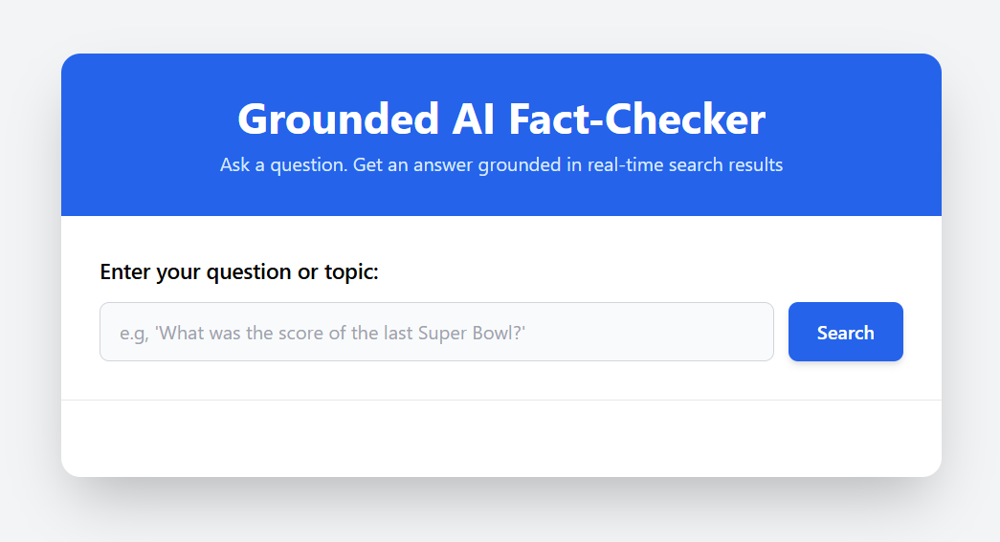

# 🌐 Gemini-Powered Fact-Checker

This is a web application that answers user questions using **Google's Gemini 2.5 Flash** model.  
The AI is *grounded* in real-time Google Search results to provide accurate, up-to-date, and verifiable answers.

This approach solves a major problem with modern AI: **hallucinations**.  
Instead of making up an answer, this tool finds factual information from the web, synthesizes a summary, and provides a list of sources for its answer.

---

## 🖼️ Screenshot

Here’s what the app looks like in action:



---

## 🚀 Project Status

**Complete:** This project is fully functional.

---

## ✨ Features

- **Real-time Factual Answers:** Uses the Gemini model's built-in Google Search tool to pull live data from the web.  
- **Source Citations:** Provides a clickable list of the sources the AI used to generate its answer.  
- **Clean & Responsive UI:** Built with Tailwind CSS, the interface is simple, professional, and works on all device sizes.  
- **Robust UI State Management:** The app provides clear feedback to the user with three distinct states:
  - **Loading:** A spinner appears while the API is working, and the form is disabled.  
  - **Success:** The answer and sources are displayed clearly.  
  - **Error:** A user-friendly error message is shown if the API call fails or the network is down.

---

## 🧩 Technologies Used

- **HTML5:** For the core structure of the application.  
- **Tailwind CSS:** For all styling, layout, and responsiveness.  
- **JavaScript (ES6+):** For all application logic, including DOM manipulation, event handling, and API calls.  
- **Google Gemini 2.5 Flash API:** The specific generative AI model used to synthesize answers.  
- **Gemini's Google Search Tool:** The "grounding" feature that connects the AI to live web results.

---

## 💡 Skills Demonstrated

This project showcases a wide range of modern web development skills:

- **Front-End Development:** Building a clean, responsive, and user-friendly interface from scratch using HTML and Tailwind CSS.  
- **API Integration:** Making asynchronous fetch requests to the Google AI (Gemini) API.  
- **Asynchronous JavaScript:** Using `async/await` to handle network requests without freezing the browser.  
- **DOM Manipulation:** Using vanilla JavaScript (`getElementById`, `createElement`, `appendChild`, `classList`, etc.) to dynamically update the page.  
- **State Management:** Writing functions to cleanly manage and transition between different UI states (*loading, success, error*).  
- **Error Handling:** Implementing `try...catch` blocks to build a robust application that fails gracefully and provides clear user feedback.  
- **JSON Parsing:** Handling and safely parsing complex JSON data returned from the API.

---

## ⚙️ Setup & Installation

To run this project locally, you will need to use your own **free API key from Google AI Studio**.

### 1. Clone the Repository
```bash
git clone [https://github.com/YSLSupreme/aifactchecker.git]
cd AIFactChecker
